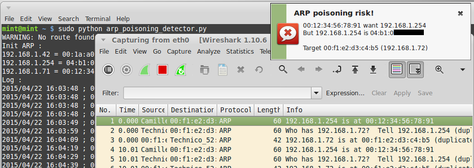

# ARP poisoning detector
Simple detector of ARP poisoning attack

Install
-------
```
sudo apt-get install python-scapy
wget -q https://raw.githubusercontent.com/Oros42/ARP_poisoning_detector/master/arp_poisoning_detector.py
```

Run
---
```
sudo python arp_poisoning_detector.py
```


Example of output
------------------

```
$ sudo python arp_poisoning_detector.py 
WARNING: No route found for IPv6 destination :: (no default route?)
Init ARP :
192.168.1.254 = ab:cd:ef:98:76:54
192.168.1.5 = 01:23:45:67:89:10
192.168.1.6 = aa:11:bb:22:cc:44
Log :
2015/04/22 13:16:41 ; 01:23:45:67:89:10 want 192.168.1.254 ; But 192.168.1.254 is ab:cd:ef:98:76:54 ; Target 00:f1:e2:d3:c4:b5 (192.168.1.7)
2015/04/22 13:16:42 ; 01:23:45:67:89:10 want 192.168.1.254 ; But 192.168.1.254 is ab:cd:ef:98:76:54 ; Target 00:f1:e2:d3:c4:b5 (192.168.1.7)
2015/04/22 13:16:44 ; 01:23:45:67:89:10 want 192.168.1.254 ; But 192.168.1.254 is ab:cd:ef:98:76:54 ; Target 00:f1:e2:d3:c4:b5 (192.168.1.7)
```
  
